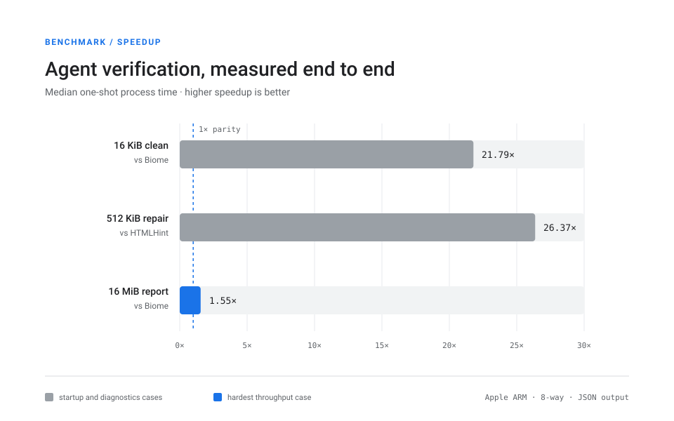

<div align="center">
  <p><code>html-lint</code></p>
  <h1>⚡ LintBolt</h1>
  <p><strong>The HTML linter for the Agent Era.</strong></p>
  <p>Verify generated HTML with a cache-conscious, multithreaded Rust engine and stable JSON output.</p>
  <p><strong>Fast edit–verify loops · Exact byte spans · Deterministic output · No human-oriented formatting</strong></p>
</div>

---

LintBolt is built for agents that create and revise HTML artifacts repeatedly. Give it files or directories, receive one JSON document, and use the exit status to decide what happens next.

## Verify an HTML artifact

Build the release binary:

```sh
cargo build --release --bin html-lint
```

Lint a file or scan a directory in parallel:

```sh
target/release/html-lint artifact.html
target/release/html-lint --threads 8 artifacts/
```

Lint standard input while preserving an agent-visible filename:

```sh
target/release/html-lint --stdin-filename artifact.html -
```

LintBolt writes exactly one JSON document to standard output, including invocation and I/O failures.

```json
{
  "schema_version": 1,
  "status": "findings",
  "files": [
    {
      "path": "artifact.html",
      "bytes": 64,
      "diagnostics": [
        {
          "rule": "img-alt",
          "severity": "error",
          "message": "Image elements must have an alt attribute",
          "byte_start": 35,
          "byte_end": 55,
          "line": 3,
          "column": 3,
          "help": "Add alt text, or use alt=\"\" for a decorative image."
        }
      ]
    }
  ],
  "summary": {
    "files": 1,
    "bytes": 64,
    "findings": 1,
    "operational_errors": 0,
    "truncated": false
  }
}
```

Exit status `0` means the run is clean, `1` means findings were emitted, and `2` means the invocation failed.

## Why it is fast

- **Skip the thread-pool tax for one file.** The caller-thread fast path keeps the common agent loop short.
- **Parallelize at file boundaries.** Rayon workers own their scanner and diagnostic buffers, improving cache affinity and avoiding shared hot cache lines.
- **Keep the scanner predictable.** Compact tag and rule state makes common branches low-entropy and easier to predict, while the non-inlined diagnostic path stays out of the hot instruction stream.
- **Do less work for narrow rule sets.** Rule-specialized paths skip unused text, comment, and attribute-value materialization.
- **Merge deterministically.** Workers sort findings once after parallel execution, so speed does not make output unstable.

## Benchmark results

The current measurements compare end-to-end, one-shot JSON invocations. That includes process startup, parsing, linting, serialization, and shutdown—the cost an agent actually pays.



| Fixture | Workload | LintBolt | Fastest qualifying alternative | Speedup |
|---|---|---:|---:|---:|
| 16 KiB clean | Startup-sensitive | 3.45 ms | Biome: 75.18 ms | **21.79×** |
| 512 KiB repair | 256 serialized findings | 6.87 ms | HTMLHint: 181.20 ms | **26.37×** |
| 16 MiB report | Cache and throughput pressure | 57.10 ms | Biome: 88.52 ms | **1.55×** |

These medians were collected on Apple ARM with eight-way execution on macOS using Rust 1.98. The small fixture used 30 measured runs. The mixed and large fixtures used 5 warmups followed by 20 measured runs, with deterministic randomized tool order. All tools used an equivalent `img-alt` rule and emitted machine-readable output. Markuplint was excluded from the large-file comparison after exceeding 210 seconds; its small and mixed results remain in the full matrix.

The 512 KiB speedup is a conservative comparison across the final optimized LintBolt run and the full competitor matrix. The 16 KiB and 16 MiB figures come from the final head-to-head run. Treat these results as reproducible measurements on this machine, not universal performance guarantees.

- [Final benchmark summary](benchmarks/results/summary.json)
- [Final LintBolt–Biome head-to-head](benchmarks/results/optimized-fat-headline.json)
- [Full competitor matrix](benchmarks/results/baseline-full.json)
- [Fixture manifest and hashes](benchmarks/fixtures/manifest.json)
- [Benchmark methodology](benchmarks/README.md)

## Select rules

The default rule set is `all`. Use the cross-tool common profile when an agent only needs missing alternative-text checks:

```sh
target/release/html-lint --rules common artifact.html
```

The `all` preset enables `img-alt`, `html-lang`, `button-type`, `iframe-title`, `doctype-html`, and tokenizer `parse-error` diagnostics. A comma-separated rule list is also accepted.

```sh
target/release/html-lint --rules html-lang,img-alt artifact.html
```

Use `--max-diagnostics N` to bound JSON size and `--threads N` to set the worker count for multi-file scans.

## Build, test, and benchmark

```sh
cargo test
cargo clippy --all-targets -- -D warnings
cargo run --release --bin generate_bench_fixtures
cargo run --release --bin benchmark
```

The harness verifies fixture hashes before every run and writes raw samples plus calculated summaries to `benchmarks/results/`. See the [benchmark guide](benchmarks/README.md) for smoke checks, competitor configuration, and qualification rules.

## Project status

LintBolt currently targets agent-generated HTML and optimizes for fast local verification. The JSON schema is versioned, diagnostic ordering is deterministic, and the WHATWG tokenizer retains exact source locations through raw-text elements such as `script`, `style`, `textarea`, and `title`.

Read the [Google Developer Documentation–style design](docs/plans/2026-08-25-rust-html-linter/design.html) for the architecture and tradeoff analysis that led to this implementation.
